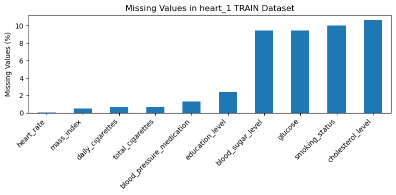
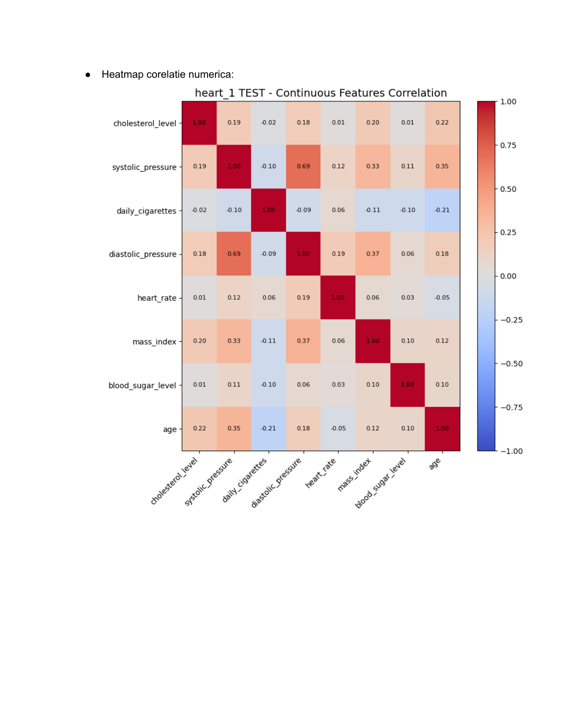
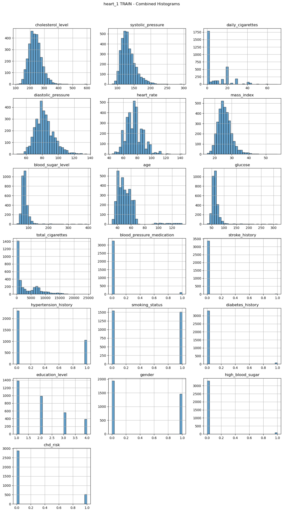
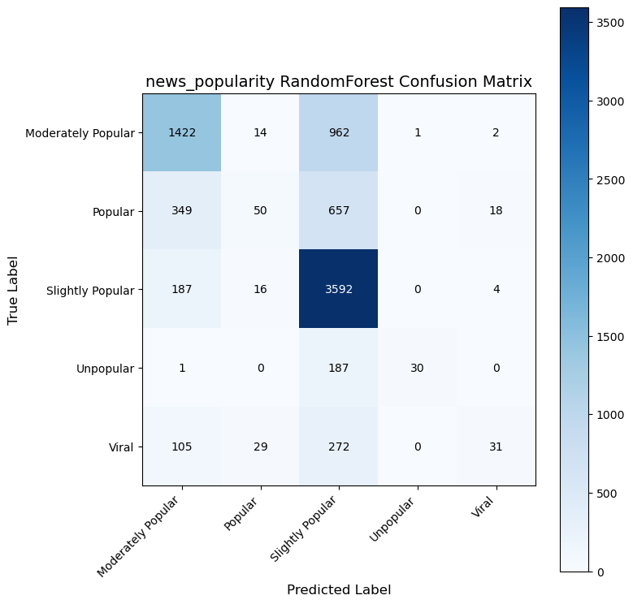
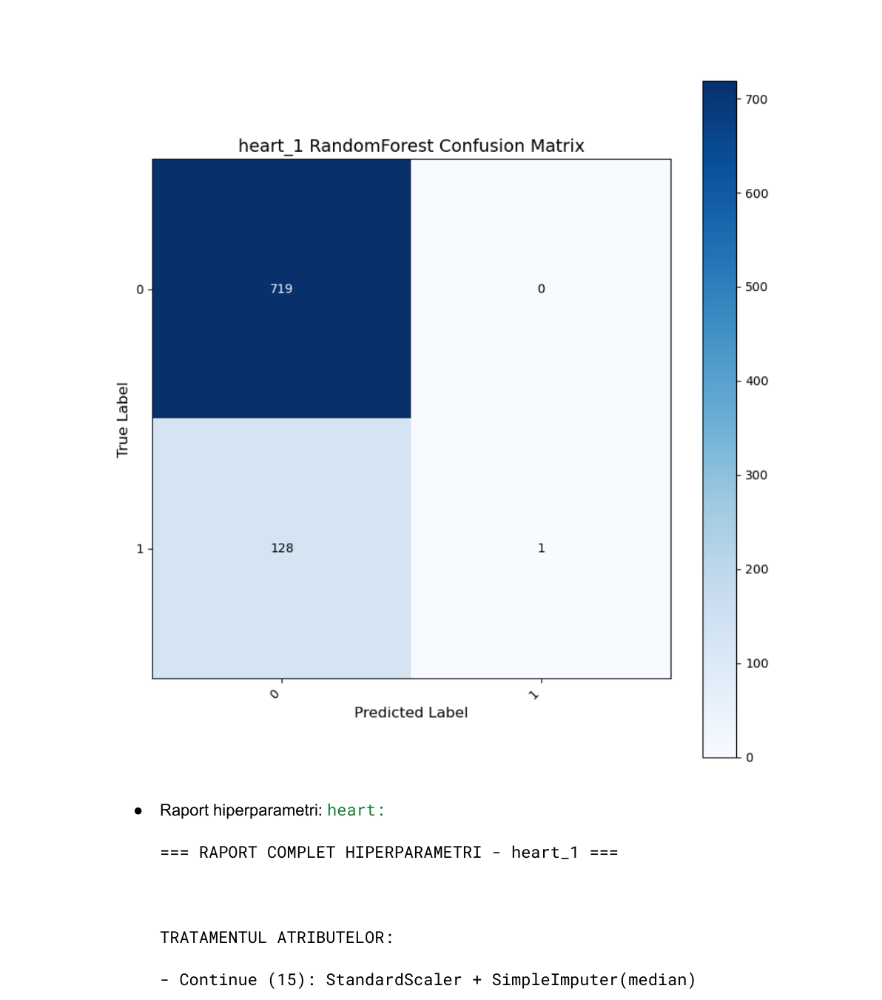
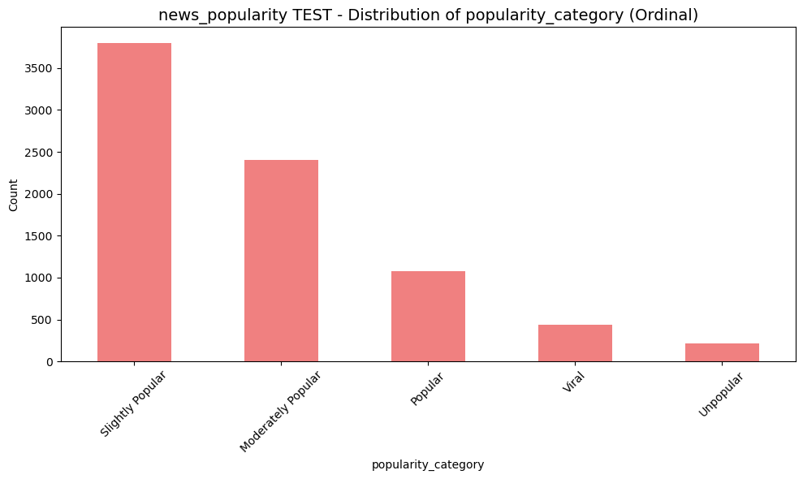

# ML Classification Pipeline — End-to-End Analysis & Modeling

A complete machine learning pipeline that automates **exploratory data analysis**, **preprocessing**, **feature engineering**, and **multi-model evaluation** for tabular classification tasks.

Applied to two real-world datasets:
- **News Popularity** — predicting article virality across 5 popularity levels
- **Heart Disease Risk** — binary classification for 10-year cardiac risk

---

## Key Features

- **Automated EDA**: missing value analysis, descriptive statistics for continuous/discrete/nominal/ordinal attributes, distribution plots, and combined histograms
- **Outlier Detection & Treatment**: IQR-based detection with median imputation and detailed reporting
- **Redundancy Removal**: Pearson correlation (threshold > 0.8) for numeric features, Cramér's V (threshold > 0.5) for categorical features
- **Class Imbalance Handling**: automatic detection and `class_weight='balanced'` activation
- **5 Classification Models**: Decision Tree, Random Forest (with optional GridSearchCV), Logistic Regression (scikit-learn), Manual Logistic Regression (from scratch), and MLP Neural Network
- **Manual Logistic Regression**: custom implementation supporting both binary (sigmoid) and multi-class (softmax) classification with L1/L2 regularization and gradient descent
- **Comprehensive Output**: confusion matrices, correlation heatmaps, cost curves, training logs, and per-class metrics exported to CSV

---

## Results

| Model | News Popularity (5-class) | Heart Disease (binary) |
|---|---|---|
| Decision Tree | 0.38 | 0.76 |
| Random Forest | **0.62** | **0.85** |
| Logistic Regression | 0.50 | 0.67 |
| Manual Logistic Regression | 0.56 | 0.84 |
| MLP Neural Network | 0.60 | — |

Random Forest achieved the best performance on both datasets. The news popularity task is inherently harder due to 5 imbalanced classes and high feature dimensionality (43 continuous + 12 categorical features).

---

## Project Structure

```
├── tema2.py                  # Main pipeline script
├── screenshots/              # Visualization samples from pipeline output
│   ├── missing_values.png
│   ├── correlation_heatmap.png
│   ├── combined_histograms.png
│   ├── confusion_matrix_rf.png
│   ├── confusion_matrix_heart.png
│   └── class_distribution.png
├── plots/                    # All generated visualizations (after running)
│   ├── *_missing_values.png
│   ├── *_combined_histograms.png
│   ├── *_corr_continuous.png
│   ├── *_confusion_matrix.png
│   └── ...
├── reports/                  # CSV reports and statistics
│   ├── *_continuous_stats.csv
│   ├── *_outliers_report.csv
│   ├── *_redundancy_report.csv
│   └── *_hyperparameters_report.txt
├── metrics/                  # Model evaluation results
│   └── *_complete_metrics.csv
└── logs/                     # Execution logs
    └── ml_pipeline_log_*.txt
```

---

## Sample Outputs

### Missing Value Analysis


### Correlation Heatmap


### Combined Histograms


### Confusion Matrices




### Class Distribution


---

## Pipeline Workflow

```
1. Dataset Detection     → auto-discovers *_train.csv / *_test.csv pairs
2. EDA                   → missing values, statistics, distributions
3. Outlier Treatment     → IQR method, replace with median
4. Numeric Redundancy    → Pearson correlation > 0.8 → remove
5. Categorical Redundancy→ Cramér's V > 0.5 → remove
6. Preprocessing         → impute, scale, encode (Pipeline + ColumnTransformer)
7. Model Training        → 5 models with class balancing
8. Evaluation            → accuracy, precision, recall, F1, confusion matrices
9. Export                → plots, CSVs, logs, hyperparameter reports
```

---

## How to Run

### Requirements

```bash
pip install pandas numpy matplotlib scikit-learn scipy
```

### Usage

Place your dataset files (`*_train.csv` and `*_test.csv`) in the same directory as the script, then run:

```bash
python tema2.py
```

The pipeline will automatically detect all dataset pairs and run the full analysis. Results are saved to `plots/`, `metrics/`, `reports/`, and `logs/`.

---

## Technical Details

### Preprocessing Pipeline

- **Continuous features**: `SimpleImputer(median)` → `StandardScaler`
- **Nominal categorical**: `SimpleImputer(most_frequent)` → `OneHotEncoder`
- **Ordinal categorical**: `SimpleImputer(most_frequent)` → `OrdinalEncoder`

### Manual Logistic Regression Implementation

Built from scratch using NumPy — supports:
- **Binary classification** via sigmoid activation
- **Multi-class classification** via softmax activation
- **Regularization**: L1 (Lasso) and L2 (Ridge)
- **Convergence check**: early stopping when cost change < 1e-8

### Hyperparameter Tuning

Random Forest supports optional `GridSearchCV` optimization searching over `n_estimators`, `max_depth`, `min_samples_leaf`, and `criterion`.

---

## Tech Stack

Python · Pandas · NumPy · Scikit-learn · Matplotlib · SciPy

---

## License

This project is available for reference and educational purposes.
